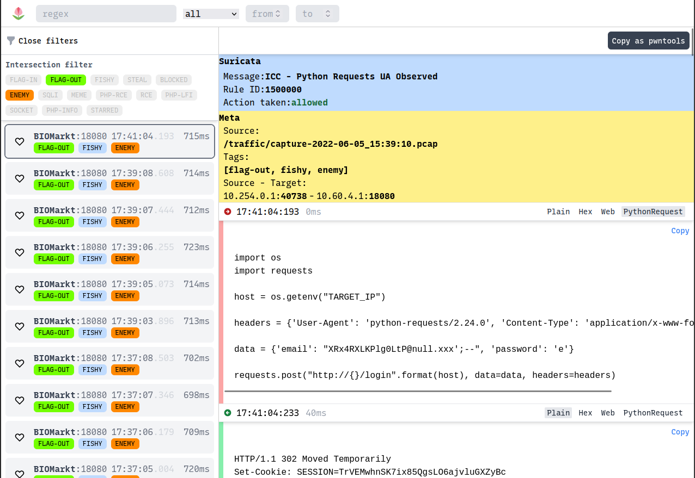

# 🌷 Tulip

Tulip is a flow analyzer meant for use during Attack / Defence CTF competitions. It allows players to easily find some traffic related to their service and automatically generates python snippets to replicate attacks.

## Origins
Tulip was developed by Team Europe for use in the first International Cyber Security Challenge. The project is a fork of [flower](https://github.com/secgroup/flower), but it contains quite some changes:
* New front-end (typescript / react / tailwind)
* New ingestor code, based on gopacket
* IPv6 support
* Vastly improved filter and tagging system.
* Deep links for easy collaboration
* Added an http decoding pass for compressed data
* Synchronized with Suricata.

## Screenshots


## Configuration
Before starting the stack, edit `services/configurations.py`:

```
vm_ip = "10.60.4.1"
services = [{"ip": vm_ip, "port": 18080, "name": "BIOMarkt"},
            {"ip": vm_ip, "port": 5555, "name": "SaaS"},
]
```

You can also edit this during the CTF, just rebuild the `api` service:
```
docker-compose up --build -d api
```

## Usage

The stack can be started with docker-compose:
```
docker-compose up -d --build
```
To ingest traffic, it is recommended to create a shared bind mount with the docker-compose. One convenient way to set this up is as follows:
1. On the vulnbox, start a rotating packet sniffer (e.g. tcpdump, suricata, ...)
1. Using rsync, copy complete captures to the machine running tulip (e.g. to /traffic)
1. Add a bind to the assembler service so it can read /traffic

The ingestor will use inotify to watch for new pcap's and suricata logs. No need to set a chron job.


## Suricata synchronization

### Metadata
Tags are read from the metadata field of a rule. For example, here's a simple rule to detect a path traversal:
```
alert tcp any any -> any any (msg: "Path Traversal-../"; flow:to_server; content: "../"; metadata: tag path_traversal; sid:1; rev: 1;)
```
Once this rule is seen in traffic, the `path_traversal` tag will automatically be added to the filters in Tulip.


### eve.json
Suricata alerts are read directly from the `eve.json` file. Because this file can get quite verbose when all extensions are enabled, it is recommended to strip the config down a fair bit. For example:
```yaml
# ...
  - eve-log:
      enabled: yes
      filetype: regular #regular|syslog|unix_dgram|unix_stream|redis
      filename: eve.json
      pcap-file: false
      community-id: false
      community-id-seed: 0
      types:
        - alert:
            metadata: yes
            # Enable the logging of tagged packets for rules using the
            # "tag" keyword.
            tagged-packets: yes
# ...
```

Sessions with matched alerts will be highlighted in the front-end and include which rule was matched.

# Security
Your Tulip instance will probably contain sensitive CTF information, like flags stolen from your machines. If you expose it to the internet and other people find it, you risk losing additional flags. It is recommended to host it on an internal network (for instance behind a VPN) or to put Tulip behind some form of authentication.

# Credits
Tulip was written by [@RickdeJager](https://github.com/rickdejager) and [@Bazumo](https://github.com/bazumo), with additional help from [@Sijisu](https://github.com/sijisu). Thanks to our fellow Team Europe players and coaches for testing, feedback and suggestions. Finally, thanks to the team behind [flower](https://github.com/secgroup/flower) for opensourcing their tooling.
